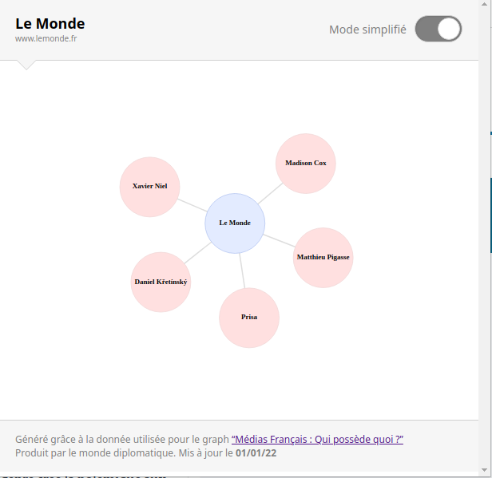

  <h1>watch-dogs</h1>

## Extension web pour les lecteurs de la presse française

Watch dogs est une extension web qui permet aux utilisateurs lorsque qu'il visite un site internet d'actualité de connaitre à qui appartient ce media (en utilisant les données [du monde diplomatique](https://github.com/mdiplo/Medias_francais))

## Support

Testé sur :

- Chrome

## Listes des fonctionnalités

- Notification sur des urls connues
- Affichage d'un graph par journaux
- Ajout du mode simplifié

## Application

### Mode Complet

Le mode complet vous permet de voir l'ensemble des personnes et des entreprises qui finance le journal

### Mode simplifié

Le mode simplifié vous permet de ne voir que les personnes et les entreprises finaux qui finance le journal

