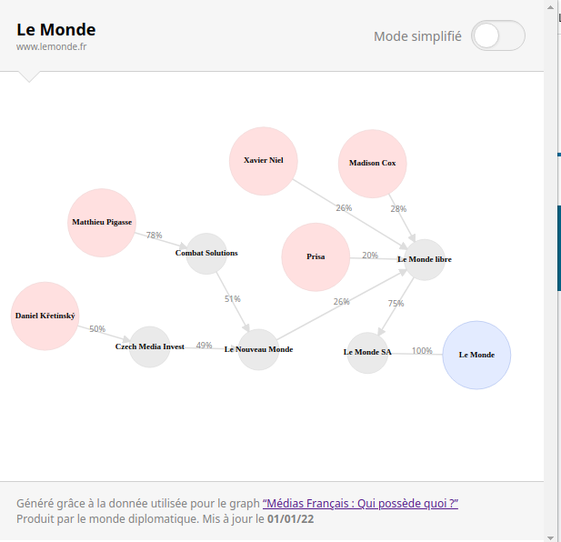

  

**Watchdogs** est une **extension navigateur** ( pour l'instant éxclusivement disponible sur chrome ) qui permet, lors de la visite du site internet d'un journal, d'avoir des informations sur sa gouvernance. L'extension se base sur le [jeu de données](https://github.com/mdiplo/Medias_francais) de l'infographie ["Médias français : Qui possède quoi ?"](https://www.monde-diplomatique.fr/cartes/PPA) crée et mise à jour par [le monde diplomatique](https://www.monde-diplomatique.fr/).

 

 

### L'application

Elle se présente sous la forme d'une petite icone "W" en haut à droite de votre navigateur. Cette icone devient verte si il existe des données concernant le média que vous etes en train de consulter. Si tel est le cas, il suffit de cliquer sur le W pour voir le graphique détaillant la gouvernance de ce journal.

Le graphique représente l'ensemble des personnes physiques ou morales ayant une implication dans la gouvernance du média en question. 

Un mode simplifié vous permettant de filtrer uniquement que les personnes physiques est également présent, pour l'activer, il vous suffit de cliquer sur le bouton en haut à droite du graphique.

 

### Licence

Ce projet à été développe par Aymeric Georgin et Thibaud Frere sous licence MIT.
